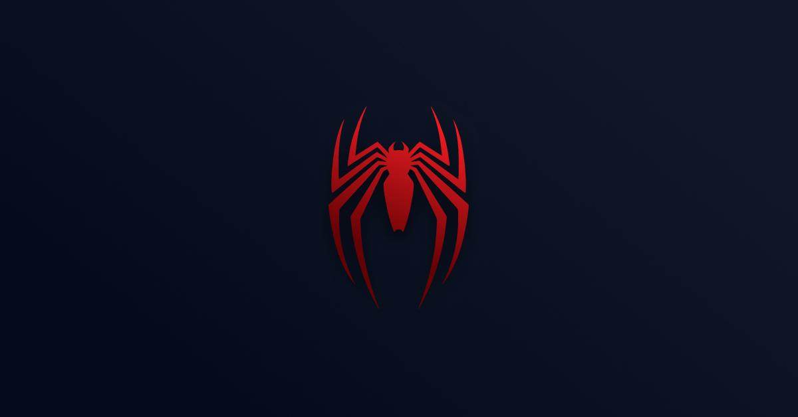

# Spider-man PS4 - FrontPUSH

<h1 align="center">
 🚧 Este Readme está em construção 🚧
</h1>

 

📜 Este é um case do curso online FrontPUSH (https://frontpush.com.br/) 
com o objetivo de ensinar sobre CSS e animações utilizando a biblioteca GSAP 
(https://greensock.com/)

## Site
- [frontweek-spiderman.com](https://omatheusesteves.github.io/frontweek-spiderman/)

## 💻 Projeto / 🚀 Tecnologias / 🔖 Layout

💡 Basicamente, trata-se de um website que visa aprimorar o entendimento de 
realizar layouts mais entusiastas, focados na propriedade "position" do CSS.
É um pouco diferente do que é comumente utilizado em layout de websites 
(utilizando outros recursos  flexbox, float, grid layout). O design foi feito 
interamente no Figma e implementado com as seguintes ferramentas/tecnologias:

* HTML5
* JSES6+
* SCSS (https://sass-lang.com/)
* GSAP (https://greensock.com/)
* Figma (UI Design) (https://figma.com/)

Made with ♥ and a lot of ☕ by Matheus Esteves
